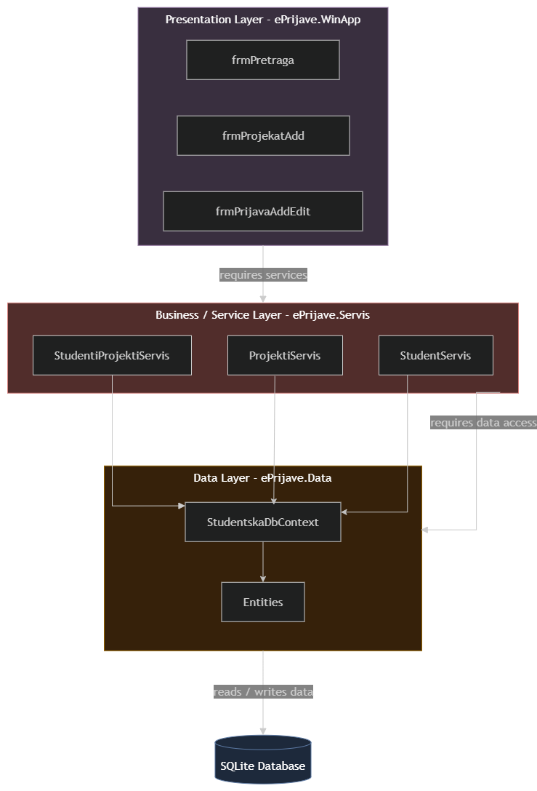

# Student Projects Management System

Desktop application for managing projects and student applications to projects, developed using C# WinForms technology.

## Note

This project represents a solution to an **exam example** from the **Programming III** course.

The basic requirements and functionalities of the project were defined through an exam example published by

- Professor: **dr. sc. Denis Mušić**
- GitHub: **https://github.com/denis-music/cs-winforms-exam-template-2025-26**

## About the Project

The application enables the management of students, projects, and student applications to projects.

Through the application, the user can view existing applications, search and filter data, add new projects and applications, and edit existing applications.

The application also contains various validations that ensure correct data entry.

## Main Features

- viewing student applications to projects
- searching applications by student first and last name
- searching by project name
- filtering applications by application status
- filtering by application state
- adding new projects
- adding new student applications to projects
- editing existing applications
- generating applications for available projects
- creating reports
- data validation during entry and editing
- viewing and managing data from the SQLite database

## Technologies

The project was developed using the following technologies and tools:

- **C#**
- **.NET**
- **Windows Forms**
- **Entity Framework Core**
- **SQLite**
- **Visual Studio**
- **Git**
- **GitHub**

## Project Architecture

The project is organized into multiple layers in order to separate data access, business logic, and the user interface.

### Studentska.Data

A layer responsible for working with the database and defining the models, i.e. entities, used in the application.

### Studentska.Servis

Contains service classes that implement the application's business logic and enable communication between the user interface and the data access layer.

### Studentska.WinApp

A Windows Forms application that represents the user interface and enables the user to work with students, projects, and applications.

## Database

The **SQLite** database is used for data storage.

The main entities used in the application are:

- `Studenti`
- `Projekti`
- `StudentiProjekti` (represents **applications**, the relationship between the `Studenti` and `Projekti` entities)

The database is located within the application and is used for permanent storage of the data required for the system to operate.

## Working with Projects

The application enables adding new projects through a dedicated form.

When adding a project, the following data is entered:

- project name
- note
- completion deadline
- maximum number of students
- project activity status
- project logo

A project can be active or inactive, which affects its availability when creating new applications.

## Working with Applications

The user can add a new student application to a selected project.

When creating an application, the following are selected:

- student
- project
- application date
- application status

When editing an existing application, certain fields may be restricted depending on the current application status, ensuring a valid status transition flow.

## Search and Filtering

The application contains a form for viewing and searching applications.

Data can be filtered by:

- student first and last name
- project name
- application status
- application state

The results are displayed in a tabular format using the `DataGridView` control.

## Data Validation

When working with the application, various conditions are checked to prevent invalid data entry.

Validations include, among other things:

- required fields
- validity of entered values
- project availability
- maximum number of students on a project
- existence of existing applications
- allowed status changes
- project completion deadline

In this way, the application prevents situations that are not permitted by the defined system rules.

## Application Generation

The application enables automatic generation of applications for a student.

During generation, conditions are checked to determine whether a particular project can be offered to the student.

Generated applications are displayed to the user through an informational section of the form, where it is possible to track which applications were successfully added.

## UML and System Analysis

In addition to implementing the application, a system analysis was carried out using UML diagrams.

The analysis and diagrams were created using materials from the **Software Analysis and Design** course.

- Professor: **dr. sc. Emina Junuz**
- Materials: **course materials from Software Analysis and Design**

The system analysis covers:

- system domain
- key entities and their relationships
- user and system
- communication flows
- processes executed within the application

### UML Diagrams

- Use Case
- Domain Model
- System Sequence Diagram
- Class Diagram
- Sequence Diagram
- State Diagram
- Communication Diagram
- Activity Diagram
- Component Diagram
- Deployment Diagram

## Getting Started

To run the project locally:

1. Clone the repository.
2. Open the `.sln` solution file in Visual Studio.
3. Rebuild to restore the required NuGet packages.
4. Build and run the application from the solution.

## Project Analysis and Documentation

A detailed analysis of the project is available in `ePrijave.pdf`.

The document contains an overview of the application, screenshots and explanations of the implemented forms, as well as the UML diagrams created as part of the system analysis and design.

## Project Purpose

This project was developed as a practical way to bring together the knowledge and skills acquired throughout my studies, with a focus on software development, database management, and system analysis and design.
#### Uma Dervišević
